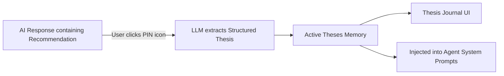

# User Guide

Welcome to the CairnIQ User Guide. This document provides a complete walkthrough of the application's capabilities, its high-performance interfaces, background operations, cognitive systems, and data infrastructure.

---

## Table of Contents

1. [Core Capabilities & Navigation](#1-core-capabilities--navigation)
2. [Chat Interface: Toggles & Quick Actions](#2-chat-interface-toggles--quick-actions)
3. [File Uploads & Portfolio Management](#3-file-uploads--portfolio-management)
4. [Thesis Journal & Active Theses](#4-thesis-journal--active-theses)
5. [Active Thesis Health & Live Alerts](#5-active-thesis-health--live-alerts)
6. [Alerts & Background Monitoring](#6-alerts--background-monitoring)
7. [Advisor Ledger (Past Recommendations Scorecard)](#7-advisor-ledger-past-recommendations-scorecard)
8. [Weekly Review (Your Sunday One-Pager)](#8-weekly-review-your-sunday-one-pager)
9. [Context Page: Profile, Goal, Playbook & Graph](#9-context-page-profile-goal-playbook--graph)
10. [User Memory, Risk Constraints & Custom Instructions](#10-user-memory--custom-instructions)
11. [Live News Feed & Market Pulse](#11-live-news-feed--market-pulse)
12. [AI Provider Setup & Keychain Security](#12-ai-provider-setup--keychain-security)
13. [Data Source Integration Matrix](#13-data-source-integration-matrix)
14. [Troubleshooting & Diagnostics](#14-troubleshooting--diagnostics)

---

## 1. Core Capabilities & Navigation

CairnIQ is a private, local-first financial advisor agent framework that combines real-time market data, deep cognitive analysis, and structured memory tracking. It operates as a multi-agent system where a **Supervisor** routes user queries to specialized reasoning engines (news, fundamentals, portfolio metrics, risk profiles, macro indicators).

### Interface Layout

The dashboard is split into three high-density components:
*   **Left Navigation Sidebar**: Toggle between primary application views:
    *   **Dashboard**: Portfolio analytics overview.
    *   **Chat**: The main conversational workspace.
    *   **Context**: Three tabs — your profile (with the wealth goal, drawdown playbook and readiness switchboard), what the system has learned, and the semantic knowledge graph.
    *   **Thesis Journal**: The trade journal showing active theses, catalysts, and conviction tracking.
    *   **Advisor Ledger**: The scorecard of past recommendations, scored against what actually happened.
    *   **Alerts**: The inbox for everything the system raised while you weren't asking. Carries an unread badge.
    *   **Weekly Review**: One page, once a week — goal, market, how past advice scored, what was said, what's still blank.
    *   **Portfolio**: The manual holdings grid, where you can modify rows, upload ledger CSVs, or download templates.
    *   **Settings**: Infrastructure management panel for credentials, API tokens, region locales, base currencies, model IDs, and the background scheduler toggle.
*   **Center Panel**: Displays the active workspace (the interactive chat interface, context editor, journal logs, or holdings sheet).
*   **Right Information Sidebar**:
    *   **Portfolio vs. Benchmark Chart**: A real-time sparkline comparing your portfolio's performance against the S&P 500 (SPX).
    *   **Market Pulse Briefing**: A snapshot of current market regime, streak days, volatility indicators (VIX), and overall Fear & Greed levels.
    *   **Primary News Feed**: Real-time summaries of market events affecting your current holdings.

---

## 2. Chat Interface: Toggles & Quick Actions

The chat workspace is designed for rapid execution and deep strategy lookup. It features specialized modes and quick action macros to automate common analysis workflows.

```
+--------------------------------------------------------------------------------+
|  [Input Area]                                                                  |
|  [ Type your question or stock symbol here...                       ]          |
|                                                                                |
|  [ + Attach File ]               [ GHOST (Off) ]   [ DEEP (Off) ]   [ Send ]   |
+--------------------------------------------------------------------------------+
```

### Analysis Mode Toggles

Directly below the chat input box, there are two primary toggles:

*   **DEEP Toggle**: Enables Deep Analysis mode.
    *   **Functionality**: Maps the query to `Detailed (Deep Analysis)` response parameters. It routes tasks to the primary, high-capacity reasoning model slot (`AIDLC_MODEL_ID`) rather than fast models.
    *   **Use Case**: Use when conducting macro portfolio stress tests, multi-year asset allocations, or searching for hidden correlations.
    *   **UI Indicator**: Highlights in solid **primary green/emerald** with a subtle outer shadow when enabled.
*   **GHOST Toggle**: Enables Privacy Mode.
    *   **Functionality**: Skips the memory write path entirely. No facts, preferences, or profile changes are saved to `user_memory.json` or mirrored to the knowledge graph.
    *   **Alternative Triggers**: You can also force Ghost Mode by typing tags like `@Private`, `@Ghost`, `[Private]`, or `No capture` directly inside your message text.
    *   **UI Indicator**: Highlights in **amber** when enabled, displaying a status badge: `🛡️ Ghost Mode Active: Conversation will not be recorded in memory.`

---

### Chat Quick Actions

Quick Actions are macro buttons positioned above the input box that auto-inject complex, pre-formatted instructions into the agent loop.

1.  **Today's Priority (`btn-priority`)**:
    *   *No Ticker Input*: Executes a 4-stage portfolio triage check:
        *   **Stage 1 (Regime & Secular Themes)**: Resolves the current market posture and maps it against user-defined structural themes (secular holdings).
        *   **Stage 2 (Portfolio Health)**: Verifies asset distributions (Equities, Fixed Income, Cash) using bounds dynamically calculated from your risk tolerance and retirement horizon (e.g., Aggressive/15yr+ target is 70–85% equities, shifting down 10% in defensive regimes).
        *   **Stage 3 (Triage)**: Applies prioritised decision rules: checks for structural risk (secular trim triggers met, concentration >8%, thesis-breakers), identifies captured opportunities (high cash levels + positive technical triggers), executes lazy rebalancing, or defaults to "DO NOTHING".
        *   **Stage 4 (Position Sizing)**: Computes specific dollar allocations, shares to trade, and stop levels. Sizing is constrained by **the limits you have stated** in your profile (see [Risk Constraints](#risk-constraints)) — there is no built-in house limit, so if you have not stated one, none is applied or quoted back to you.
    *   *With Ticker Input (e.g., "AAPL" in chat input + click)*: Appends a **FOCUS** directive that runs the same full framework, but specifically asks whether acting on that ticker today is the single highest-priority action given your current holdings and market conditions.
    *   **Output structure**: A single `⭐ TODAY'S PRIORITY` action (in bold caps, or `DO NOTHING` — which is the most common, intended answer), a 2-bullet `🎯 WHY`, an `📋 EXECUTION` table (omitted when DO NOTHING), an `👀 OPPORTUNITY RADAR` (up to two awareness-only items), and a `🔔 NEXT-CHECK TRIGGER` (one observable level/event that should make you revisit). Trim/sell candidates must pass `verify_portfolio_holdings`, and tax language is suppressed when all accounts are tax-sheltered.
    *   **Precomputed before the open**: with the background scheduler enabled, this brief is generated once per morning (07:00–09:25) so clicking the button returns the cached brief instantly instead of running the full graph.
    *   **The trigger is watched for you**: the `NEXT-CHECK TRIGGER` level is stored and re-checked automatically every 30 minutes in market hours. When it crosses, the alert restates the action the advisor pre-committed to. See [Alerts & Background Monitoring](#6-alerts--background-monitoring).
2.  **Analyze (`btn-analyze`)**:
    *   Sends: `[MarketAnalyst lens=portfolio_audit] Audit my current holdings for uncompensated risk.`
    *   Audits **your actual holdings** (via `assess_portfolio_risk`, `check_portfolio_allocation`, `analyze_fx_risks`, `check_portfolio_correlation`, and `get_market_pulse_data`) and leads with the single biggest dollar-at-risk finding. It deliberately suppresses external screen picks unless your cash is above band (and even then, one suggestion max).
3.  **Scan (`btn-scan`)**:
    *   Sends: `[MarketAnalyst lens=external_screen] Find new external tickers worth attention right now.`
    *   The mirror image of Analyze: hunts for **new external tickers** (via `screen_stocks`, `scan_opportunities`, and `detect_sector_rotation`), leads with the single highest-conviction pick and a "why now," and tags each with a one-line portfolio-fit note (held / watchlist / sector-gap / overlap). It does not produce a portfolio audit.
4.  **Guru Picks (`btn-guru`)**:
    *   Sends: `[MarketAnalyst lens=guru_validation] Validate which Media Guru picks survived the opportunity pipeline.`
    *   (Appears only when guru picks are enabled) Runs `scan_guru_picks`, shows a `count_cleared / count_scanned` tally, and for each cleared pick lists the guru source, signal, freshness, pipeline status, and foundation/headwind result. Picks that failed the pipeline are not presented as passing.
5.  **Dip Plan (`btn-dip`)**:
    *   Sends: `[MarketAnalyst lens=watchlist_dip] Identify entry levels for watchlisted tickers pulling back into actionable zones.`
    *   For each watchlisted candidate (using `run_technical_analysis` and `analyze_patterns`) it gives an entry zone, a structural stop anchored to support / 40-week MA / ATR, and what would invalidate the dip thesis — quoting available cash. It will not pitch tickers you don't own and haven't watchlisted.
6.  **System Health (`btn-health`)**:
    *   Sends: `Check system health and portfolio integrity.`
    *   Synthesizes live connection statuses, key expirations, and logs fallback database paths (FAISS vs. BM25).
7.  **Market News (`btn-news`)**:
    *   Sends: `[NewsAnalyst] Summarize the most impactful market events from the last 24 hours.`
    *   Triggers the News Analyst to compile macro summaries and specific sector headlines.
8.  **Trump Yap (`btn-trump`)**:
    *   Invokes the **Political & Social Media Market Impact Analyst** via the Deep Reasoning engine.
    *   *No Input*: Calls the `get_latest_trump_yaps` tool to pull Donald Trump's most recent Truth Social posts in real time (falling back to a web search for recent statements if the feed is empty).
    *   *With Input (a pasted post, headline, or policy announcement in the chat box + click)*: Analyzes that specific statement directly instead of fetching the feed.
    *   **Output**: Maps the statement to market and **supply-chain connections** — identifying **Winners (beneficiaries)** and **Losers (vulnerable targets)** across affected sectors, commodities, and tickers (e.g. tariff threats, chip policy, energy deregulation, EV incentives, defense budget, FX moves). It then audits your portfolio for exposure to the affected names and proposes sized, stop-anchored **trigger moves** (hedges, trims, or opportunistic buys).
    *   If no recent post or catalyst is found, it returns `Data Unavailable: No recent social statements or news catalysts found.` rather than fabricating a thesis.
9.  **Systemic Risk (`btn-risk`)**:
    *   Sends: `[RiskManager] Calculate my total systemic risk exposure.`
    *   Calculates beta exposure, correlation clusters, and macroeconomic interest rate/inflation sensitivities.

---

## 3. File Uploads & Portfolio Management

CairnIQ supports two distinct upload mechanics: chat attachments for ad-hoc context loading, and structured portfolio ledger uploads for tracker updates.

### Chat File Attachments

You can supply external context directly inside the chat interface:
1.  Click the paperclip icon (`#chat-attach`) next to the composer or paste an image directly from your operating system clipboard.
2.  Supported formats include **PDFs (`application/pdf`)**, **Text files (`text/plain`)**, and **Images**.
3.  The UI encodes files as Base64 strings and appends them to the `/api/chat` request body. The agent parses documents using its fast reasoning slot, injecting their text contents directly into the chat prompt context.

### Portfolio CSV Uploads

To upload your holdings in bulk:
1.  Navigate to the **Portfolio Editor** page.
2.  Click **Download Template** to download the default schema, or construct a CSV file with the following header:

```csv
Symbol,Shares,Purchase Price,Account
AAPL,100,150.00,TFSA
MSFT,50,300.00,RRSP
GOOGL,25,140.00,Taxable
```

*   **Symbol**: Stock ticker symbol (e.g., `AAPL`, `VTI`, or Canadian assets like `SHOP.TO`).
*   **Shares**: Decimal or integer quantity held.
*   **Purchase Price**: Average price paid per share (quoted in your profile's base currency).
*   **Account**: Free-text grouping label (e.g. `TFSA`, `RRSP`, `401k`, `IRA`, `Taxable`). This allows the agent to identify tax shelters and adjust its suggestions (e.g., suppressing tax-loss harvesting language if all positions reside in tax-sheltered accounts).
3.  Click **Upload CSV** to upload your file. It replaces `user_data/my_portfolio.csv` and flushes the portfolio cache instantly.

> [!IMPORTANT]
> **Live Broker Precedence (Deduplication)**:
> If you have connected a live brokerage (Questrade or Alpaca) in settings, its holdings are pulled at runtime and merged with your manual CSV file. To prevent double-counting, **live broker positions take precedence**. If a ticker is found in both the manual CSV and the live broker sync, the live broker's position size and basis will override the manual CSV entry.

---

## 4. Thesis Journal & Active Theses

The Thesis Journal serves as a record of your active strategies. It helps prevent short-term market noise from disrupting long-term investment goals.



### Pinning a Thesis

When the AI agent provides a stock recommendation or strategic setup:
1.  Hover over the AI's response message block.
2.  Click the **Pin (Thumbtack)** icon on the message toolbar.
3.  The system calls the `/api/memory/extract_thesis` endpoint, which prompts an LLM via a structured DSPy interface to isolate the key decision factors from the text.
4.  The extracted data is stored in the `active_theses` list inside `user_memory.json` and immediately renders on the **Journal** page.

### Extracted Thesis Fields

Every pinned thesis contains the following fields:
*   `symbol`: The target ticker (e.g., `AAPL`).
*   `action`: The planned action (`BUY`, `SELL`, `HOLD`).
*   `quantity`: Target shares or dollar amount (if specified).
*   `conditions`: The tactical entry rules or valuation criteria (e.g., "Buy if price drops below $170").
*   `catalyst`: The core driving event (e.g., "Q3 earnings acceleration", "Product launch").
*   `catalyst_date`: Expected date of the catalyst.
*   `stop_loss`: Stop-loss level (e.g. "$155 close").
*   `target_price`: Expected upside exit target.
*   `expiry_date`: Time horizon for the thesis, after which it should be reviewed.
*   `notes`: Background information and conversational logs.

---

## 5. Active Thesis Health & Live Alerts

Once saved, active theses are not just static records. The system actively monitors their health by enriching them with real-time price context.

### Dynamic Drift & Volatility-Adjusted Thresholds

The system continuously evaluates your active theses against live stock data:
1.  **Extracting Target Prices**: Parses dollar figures from your saved thesis conditions and stop-loss entries.
2.  **Tracking Drift**: Calculates how far the current price has drifted from your specified entry zones:
    $$\text{Drift \%} = \frac{\text{Current Price} - \text{Target Entry}}{\text{Target Entry}} \times 100$$
3.  **Volatility (Beta) Adjustments**: To prevent false alarms on high-beta names, the system adjusts the "Entry Missed" threshold based on the stock's beta:
    *   **Low Volatility ($\text{Beta} < 0.9$)**: Tight **5%** threshold.
    *   **High Volatility ($\text{Beta} > 1.2$)**: Wide **15%** threshold.
    *   **Standard Assets ($0.9 \le \text{Beta} \le 1.2$)**: Default **8%** threshold.

### Thesis Health Flags

Flags depend on whether you **hold** the name or are **watching** it — a BUY thesis on a name you don't own yet is an entry plan being monitored for execution, not an open position, and exit flags are meaningless on it. Position state is resolved from the same source of truth the holdings verification tool reads, so the thesis block and the rest of the system can't disagree.

**Watching (not held):**
*   `ENTRY TRIGGERED`: Price is at or inside the entry zone and the position is not yet open — the moment the thesis was pinned to catch. Execute or explicitly stand down.
*   `APPROACHING ENTRY`: Above the entry zone but closing in. Not actionable yet.
*   `ENTRY MISSED`: Above the entry zone by more than your volatility-adjusted threshold, and never entered. Stand down or re-base — don't chase.
*   `SETUP BROKEN PRE-ENTRY`: Price is at/below the stop and the position was never opened. Nothing to sell; re-base or drop.
*   `TARGET REACHED PRE-ENTRY`: The move happened without you. Nothing to take profit on.

**Held:**
*   `TARGET REACHED`: The thesis's own objective is met — take profit or re-base, not "maintain".
*   `STOP BREACHED`: The thesis is invalidated by its own stop — close it.
*   `ENTRY MISSED` / `HOVERING ABOVE ENTRY`: As above, for adds.

**Either:**
*   `STALE`: The thesis has not been updated in over **30 days**.
*   `HELD STATUS UNVERIFIED`: The portfolio could not be read, so no entry or exit directive is issued at all rather than guessing.

### System Prompt Injection

These health flags are injected into system prompts under the `=== 📌 ACTIVE INVESTMENT THESES (PRIORITY) ===` header. 

When you ask the AI a question (especially when using the **Today's Priority** quick action), the Supervisor reads these flags. If a thesis is flagged as `ENTRY MISSED` or `STALE`, the agent is instructed to proactively point this out and recommend either updating the thesis, adjusting the entry zone, or closing it.

---

## 6. Alerts & Background Monitoring

CairnIQ can watch the market between conversations and come to you. Everything it raises unprompted lands in one place: the **Alerts** inbox in the left sidebar, which carries an unread badge and updates live.

### Turning it on

Background work is **opt-in per profile**. Enable the **Scheduler** toggle in **Settings** (it is off by default). With it off, nothing below runs and the app behaves purely on demand.

### What runs

| Monitor | When | What it tells you |
| :--- | :--- | :--- |
| **Morning brief** | Once, 07:00–09:25 | Today's Priority, precomputed so it's ready before the open |
| **Watch conditions** | Every 30 min, market hours | A trigger level the advisor committed to has been crossed |
| **Intraday sentinel** | ~Twice a session | The market *changed state*: a VIX or drawdown band crossing, a fresh death/golden cross, or a volume spike |
| **EDGAR events** | Once per trading day | A warning/critical 8-K item or a fresh insider cluster buy on a name you hold |
| **Event radar** | Once per trading day, morning | Earnings, ex-dividend and FOMC dates on names you hold — **T-3 and T-1 only**, each once |
| **Deployment ladder** | With the sentinel | A drawdown rung *you* wrote has been reached, restating the action you pre-committed to |
| **Weekly review** | Sunday evening | Your one-page review is assembled and ready |
| **Market pulse** | Pre-market | Regime flips and action-required pulses |
| **Portfolio snapshot** | After close | Records the day's value for your history chart |
| **Housekeeping** | Daily | Rotates logs and prunes aged conversation checkpoints (no alert; silent maintenance) |

The event radar is deliberately *not* a countdown: you get a T-3 and a T-1 notice and nothing in between, because "earnings in 9 days… 8 days…" trains you to skip the message by the time it matters. A rescheduled event raises a fresh alert rather than being swallowed by the old one, and a symbol whose data provider gave no date is reported as **unknown** — "no earnings scheduled" and "we weren't told" are different facts.

### Alert severity

*   **info** — awareness only; appears in the inbox and badge.
*   **warning** — worth a look; also raises a macOS desktop notification.
*   **critical** — acute (a bankruptcy or restatement filing, a crisis-regime flip); desktop notification.

Repeats of the same condition refresh the existing unread alert instead of piling up, and the inbox keeps the most recent 500.

### Why you don't get spammed

Three rules keep the inbox honest, and they're worth knowing because they explain why a level you're watching might *not* alert:

1.  **State changes only.** A monitor records what it sees on its first run as a silent baseline. A level that has stood all session is not news, and won't be announced. This means the first tick after enabling the scheduler is deliberately quiet.
2.  **Fire once.** A crossed watch condition is terminal — it alerts once and retires. A condition that was *already* true when the advisor wrote it is voided rather than fired, so a stale trigger can't announce itself as new.
3.  **Freshness is proved, not assumed.** An alert will not fire on a quote that can't be shown to be recent (older than 45 minutes) or on a daily bar from an earlier session. A "Real-time" label from a data provider describes the *source*, not the observation — a cached quote can carry that label hours after it was fetched. When data fails this check the reading is **skipped entirely** rather than acted on, so the crossing stays live and can still fire once good data arrives. Every alert that does fire carries its vintage: *"as of 10:28 (2 min ago)"*.

### Managing watch conditions

Pending trigger levels are readable via `GET /api/watch_conditions`, and one can be retired with `POST /api/watch_conditions/{id}/cancel`. They're created automatically when the advisor commits to a level in a Today's Priority brief or a catalyst scenario — you don't author them by hand.

---

## 7. Advisor Ledger (Past Recommendations Scorecard)

The **Advisor Ledger** page keeps every recommendation the system made and scores it against what actually happened, so its track record is a measured number rather than an impression.

*   Calls are scored against SPY over a fixed horizon: keep-or-accumulate stances (BUY / ADD / HOLD) hit when the name beats the benchmark; reduce stances (SELL / TRIM) hit when it lags.
*   Daily restatements of the same call collapse into the original recommendation instead of creating a new entry, and trimming is maturity-aware — otherwise entries aged out before they could ever be scored.
*   The resulting track record is injected into prompts, which is why the scoring semantics matter: counting a correct "keep holding a market-beater" as a miss would poison the calibration the advisor reasons from.

Read it via `GET /api/recommendations`.

*   **Statistics count calls, not rows.** A recommendation that gets restated writes several ledger rows; the scorecard groups by `(ticker, action, supersession event)` so nine graded rows are reported as the four distinct calls they actually are.
*   **A superseded call is graded, not discarded.** If the advisor reverses or replaces a call before its horizon elapses, the original is scored at the moment of supersession rather than quietly retiring unscored.

---

## 8. Weekly Review (Your Sunday One-Pager)

The **Weekly Review** page (`/review`) is one page, once a week: your goal at the top, the week's market state, how past advice actually scored, what the advisor told you in the last seven days, whether the background engines are alive, and which of your own inputs are still blank.

With the scheduler enabled it's assembled Sunday evening and delivered to your **Alerts** inbox, so it's waiting on Monday morning. You can also open the page any time.

**What it is not:** it adds no new analysis. Everything on it is read from surfaces that already exist — it never runs the model, never launches a scan, and reads the market pulse from cache rather than kicking one off. A report that triggers work is a report that can time out, cost money, or quietly change the state it's describing.

Three things worth knowing about how to read it:

1.  **Every section always appears** — including when the honest content is "nothing this week". A quiet week is a normal outcome, not a failure, and an omitted section is a silence that invites you to assume something happened.
2.  **A blank is stated, never filled.** Where a real figure can't be computed, the section says why instead of printing a plausible number.
3.  **The engine-health block is the important one on a quiet week.** It tells you whether the monitors ran at all, which is the difference between "nothing happened" and "nothing is running."

Read it via `GET /api/weekly_review`.

---

## 9. Context Page: Profile, Goal, Playbook & Graph

The **Context** page is where everything the system knows about *you* lives, in three tabs:

*   **Your Profile** — demographics and base currency, your wealth goal, your drawdown playbook, and the readiness switchboard.
*   **What I've Learned** — key facts, custom instructions, and candidate rules waiting for your confirmation.
*   **Knowledge Graph** — the semantic map of holdings, sectors, events and preferences.

(The former standalone `/memory` page was folded in here; two pages reading the same store had drifted apart.)

### Wealth Goal

Your target (low and stretch), horizon, and annual contribution. Unset means **no projection is made on your behalf** — nothing is assumed. Once set, it feeds the Monte Carlo goal projection, which is what lets a deep-drawdown alert say something useful: not "stay calm", but "at this level, with contributions continuing, the goal is still funded in N% of paths."

Note the two rates are different questions: `success_rate` is non-depletion (you don't run out), `goal_success_rate` is whether the stated goal is funded.

### Drawdown Playbook

Rules you write while calm and the system reads back when it hurts — at −15% and −25%:

*   **Never sold in a drawdown** — the positions you've decided in advance not to touch.
*   **New contributions buy first** — your priority order, highest first.
*   **Cash deployment ladder** — one rung per line, e.g. `15% = deploy half the cash reserve`. Since v2.4 these rungs are **armed**: each fires once, at the peak-to-date drawdown level you named, rather than only surfacing when the tape falls far enough to print the whole playbook.
*   **Rebalance drift trigger (%)** — the band that answers "should I rebalance?". `check_rebalance_drift` is unavailable until you set it, and says so.
*   **Note to your future self** — free text, read back verbatim.

**The app never writes an entry here.** No default never-sell list, no suggested ladder, no example band. A rule invented by software and quoted back during a crash carries the full authority of a promise you made to yourself, and you would act on it. Blank means nothing is claimed on your behalf; an unset playbook produces an alert *naming the absence* rather than filling it.

API: `GET` / `POST /api/memory/drawdown_playbook`.

### Profile Readiness (the switchboard)

Below the editors is a readiness panel listing every input only *you* can state — and, for each blank, **exactly which shipped feature is switched off because of it**. For example: no drift band means no rebalance check; no playbook means no deep-drawdown alerts and no deployment ladder; zero rated answers means the few-shot pool is empty even if hundreds of interactions are stored.

It is deliberately not a nag. A blank is a valid answer, nothing here is scored or ranked, and the panel will never suggest, default, or even give an example value — because an example read back later becomes "your" number. It only tells you where the value goes and what stays off until it's there.

API: `GET /api/profile_readiness`.

### Knowledge Graph

The graph tab displays an interactive, semantic knowledge graph powered by `NetworkX` and rendered via D3.js. It maps how your holdings, sectors, macroeconomic events, and preferences connect.

```
       [Sector: Technology]
              ^
              | IN_SECTOR
          [Stock: AAPL] <=== CORRELATED_WITH ===> [Stock: MSFT]
              ^
              | EXPOSED_TO
       [Portfolio: User] -- HAS_RISK_TOLERANCE --> [Aggressive]
```

### Automation & Graph Maintenance

*   **Portfolio Integration**: The system automatically adds relationships like `Stock --IN_SECTOR--> Sector` and `Portfolio --EXPOSED_TO--> Sector` based on your holdings. It also calculates top correlations and links highly correlated assets (correlation coefficient $>0.7$) with a `CORRELATED_WITH` edge.
*   **Staleness Pruning**: Edges can be configured with a expiration date (using a `stale_after_days` parameter). The graph manager regularly runs pruning tasks to expire old edges.
*   **Orphan Cleanups**: When edges expire, any nodes that have no remaining connections, no "owned" flags, and are classified as "Unknown" or "Theme" are automatically removed to keep the graph clean.

### Manual Customization in the UI

You can manually edit the graph from the Context view:
*   **Create Node**: Input an **Entity Name** (e.g., `AMD` or `Inflation`) and select its **Entity Type** (`Ticker`, `Sector`, `Event`, `Macro Indicator`).
*   **Create Relationship**: Connect two existing nodes by selecting a **Source** node, a **Target** node, and inputting a **Relation Type** (e.g., `Competes with`, `Depends on`, `Correlated with`).
*   **Inspector Tools**: Click on any node or edge in the graph canvas to open the **Inspector Panel**. You can view details, delete the entity, or break specific relationship links.

---

## 10. User Memory & Custom Instructions

CairnIQ uses a dual-memory system: a structured memory file for user profile facts, and a custom instructions list for user-defined guardrails.

### User Memory Structure

The flat memory manager loads and saves data to `user_data/user_memory.json`. It tracks:
*   `user_profile`: Demographics (Age, Income, Risk Tolerance, Goals, Base Currency).
*   `key_facts`: Bulleted details about your preferences (e.g., "Prefers value plays", "Avoids biotech").
*   `past_recommendations`: Logs previous recommendations to keep responses consistent.
*   `conversation_summaries`: High-level summaries of past chats.

---

### Suggested Rules (Behavioural Observations)

The system also watches what you *do* — which calls you act on, which you ignore, what you push back on, what you ask for repeatedly — and periodically drafts candidate rules from that evidence for you to accept or discard on the **What I've Learned** tab.

Two boundaries are worth knowing, because they're the point of the design:

*   **The raw observation log never reaches the model.** It is a separate, prompt-invisible store; the only route to your prompts is through a drafted candidate that *you* confirm. This is enforced by a test on the source code, not by convention.
*   **A candidate must cite its evidence.** Every drafted rule references at least two specific observations from the batch it was built from. One that cites something outside that batch is discarded rather than patched — an uncheckable claim about your own behaviour is worse than no rule at all.

No model judges any single turn as it happens; the per-turn detectors are plain deterministic checks, and the summarising pass runs later, once, over accumulated evidence, and drafts at most three candidates at a time.

API: `GET /api/observations`, `POST /api/observations/consolidate`, `GET /api/memory/lessons/pending`, `POST /api/memory/lessons/pending/{id}/confirm`.

---

### Custom Instructions ("My Instructions")

Located under the **My Instructions** feed on the Context page, this tool allows you to log rules and preferences that override default agent behaviors.

*   **How it Works**: Corrective lessons or rules you add in the UI are saved to the `lessons_learned` array in `user_memory.json`. The memory manager formats these as `-- USER LESSONS --` and injects them directly into the agent's system prompts.
*   **The list is capped at 15**, oldest-out. Because these go into every prompt, an unbounded list dilutes the rules you care about most. When a write pushes one out, the app **tells you which instruction it retired** — eviction is fine, silent eviction is not.
*   **Examples of Custom Rules**:
    *   `"Never recommend trimming a stock unless single-name concentration exceeds 8%."` (Overrides default rebalancing calculations).
    *   `"Suppress tax loss harvesting suggestions."` (Forces the agent to ignore tax-related triggers).
    *   `"Prioritize cash accumulation over buying new equities."` (Modifies the portfolio triage logic).

---

### Risk Constraints

Your risk limits live in `risk_constraints` in your profile's `user_memory.json`, and that is the **only** place they come from. There are no built-in defaults.

**Where you set them**: **Context › Risk Limits**, above Profile Readiness. Four boxes and a restricted list, and each blank box shows what stays switched off while it is blank.

*   **What you can set**: `max_position_pct` (single-name cap), `max_fund_position_pct` (ETF/fund cap), `max_sector_pct` (sector cap), `max_risk_per_trade_pct` (dollar-at-risk per trade, computed from your stated stop), and `restricted_symbols`.
*   **Clearing a limit**: empty the box (or pass `null` to the API). A malformed or non-positive value is *rejected* and leaves the existing limit standing — a typo must never silently delete a protection you deliberately set.
*   **What "unset" means**: an unstated limit **enforces nothing**. The advisor will not apply it, the compliance pre-check produces no row for it, and — importantly — it will never be quoted back to you as "your limit."
*   **Why it works this way**: the system previously shipped a hardcoded "2% risk rule" and a "10% concentration cap" that were in nobody's profile, then cited them to the user as if they had set them. Attributing an invented rule to you is exactly the failure the risk layer exists to catch, so the defaults were removed rather than documented. If you want a cap enforced, state it.
*   **Where it's used**: position sizing, the deterministic IPS compliance pre-check on every proposed trade, the optimizer's bounds and drift check, and the pre-trade candidate impact preview. Any sizing figure the system produces carries a `risk_basis` so it can't be misattributed to a rule you never set.
*   **API**: `GET` / `POST /api/memory/risk_constraints`.

#### "No limits" is an answer — but it has to be given

Leaving every box blank and never having been asked look identical in the file, and only one of them is a decision. So there is a confirmation under the boxes: *any box left blank means no limit at all on that axis, and I mean it.*

*   **Until you confirm**, sized proposals report themselves **not execution-ready** — the pre-trade check, the optimizer and the drift check each say the profile has not stated a limit and has not said it means to go without one.
*   **Nothing is blocked by this.** The check still runs, the optimizer still solves, and both still report exactly what they applied. It is a label on the proposal, not a refusal — and no cap is invented to make it go away.
*   **Confirming records which axes** were blank at that moment, not a blanket yes. If you later delete a cap you had set, that axis goes back to being an open question rather than inheriting a confirmation you gave about different ones.
*   You can withdraw it at any time by unticking the box and saving.

On the Profile Readiness panel below, a confirmed-unlimited axis shows its own mark — neither "stated" (there is no figure) nor "blank" (the question is closed) — and stops being counted as a gap.

---

## 11. Live News Feed & Market Pulse

To keep the UI responsive, expensive market calculations and news summaries are run by background workers and cached daily.

### Live News Feed

*   **Background Worker**: The `news-feed-worker` thread runs the `@NewsAnalyst` agent in the background. It fetches headlines for all your holdings, filters out noise, and compiles an Intelligence Report.
*   **Caching & Polling**: The report is saved to `user_data/daily_cache/`. The web UI polls the `/api/news-feed` endpoint every **4 seconds**. If the worker is still generating, the UI displays a loading spinner showing the progress (e.g. `(3/20)`).
*   **Forcing Refresh**: Click the refresh button (`btn-refresh-news`) on the News panel to clear the cache and trigger a fresh run.

### Market Pulse

*   **Background Worker**: The `market-pulse-worker` generates a daily macro briefing.
*   **Calculations**: Scans indexes to determine the current macro regime (**Defensive**, **Balanced**, **Constructive**, **Euphoric**), calculates a regime score out of 100, checks the VIX, and pulls the Fear & Greed index.
*   **UI Updates**: The briefing displays in the right sidebar. If the market regime changes, it adjusts your portfolio allocation bands accordingly (e.g., reducing equity bands during a Defensive regime).

---

## 12. AI Provider Setup & Keychain Security

CairnIQ splits reasoning tasks between two model slots to optimize response times and API costs.

### Dual-Model Setup

*   **Primary Model (`AIDLC_MODEL_ID`)**: High-capacity models (e.g., Claude 3.5 Opus, GPT-4o) handle complex tasks like portfolio triage, risk assessments, and rebalancing recommendations.
*   **Fast Model (`AIDLC_SONNET_MODEL_ID`)**: Faster models (e.g., Claude 3.5 Sonnet, GPT-4o-mini) handle routine tasks like news summarization, health checks, and semantic searches.

### Key Providers

1.  **AWS Bedrock** (Recommended for enterprise / data privacy):
    *   ARN-style IDs: e.g., `global.anthropic.claude-3-5-sonnet-v2-0`.
    *   Uses cross-region inference profiles (`global.*`) to optimize rate limits.
2.  **Anthropic (Direct API)**:
    *   Bare IDs: e.g., `claude-3-5-sonnet-latest`.
3.  **OpenAI (Direct API)**:
    *   IDs: e.g., `gpt-4o`, `gpt-4o-mini`.

### Keychain Security

To protect your API keys:
*   **Keychain Access**: By default, CairnIQ encrypts and stores sensitive API keys in your OS keychain (macOS Keychain Access, Windows Credential Manager, Linux Secret Service).
*   **Plaintext Fallback**: If keychain access is unavailable (e.g., running on headless servers, Docker containers), credentials fall back to `user_data/.env` in plaintext.

---

## 13. Data Source Integration Matrix

CairnIQ uses several financial data APIs to populate the dashboard and feed analytical tools.

| Provider | Purpose | Status | Cost | Notes |
| :--- | :--- | :--- | :--- | :--- |
| **AlphaVantage** | Market quotes, FX rates, charts | **Required** | Free / Paid | Free key (25 req/day) covers basic needs. |
| **FMP** | Fundamentals, SEC filings, transcripts | **Nice-to-Have** | Free / Paid | Unlocks deep earnings and insider trading analysis. |
| **FRED** | Macroeconomic indicators | **Nice-to-Have** | Free | Unlocks interest rates, CPI, inflation. Falls back to cached data if missing. |
| **Finnhub** | Sentiment & recommendations | **Nice-to-Have** | Free | Unlocks social sentiment and analyst target prices. |
| **Polygon.io** | Options chains & technical indicators | **Nice-to-Have** | Free | Unlocks advanced indicators (RSI, MACD) and options. |
| **Tavily** | Search engine for current events | **Nice-to-Have** | Free | Unlocks general web searches for the news analyst. |
| **Questrade** | Syncing Canadian holdings | **Nice-to-Have** | Free | Connects to Questrade via OAuth refresh tokens. |
| **Alpaca** | Syncing US holdings & paper trading | **Nice-to-Have** | Free | Connects to Alpaca paper/live accounts. |

---

## 14. Troubleshooting & Diagnostics

If you encounter issues, follow these steps to isolate the cause:

### System Diagnostics

1.  Open the Chat page.
2.  Select the **Health** quick action button, or type:
    ```text
    @DeepReasoning Run health check
    ```
3.  The health suite will verify your API configurations, check network latency, and output a diagnostics table.

### Common Solutions

*   **API Rate Limits**: If your FMP or AlphaVantage keys are hit by rate limits, the credential manager will place them on a **5-minute (300s) cooldown**. You can configure backup keys in `user_data/.env` (e.g., `FMP_API_KEY_2`, `FMP_API_KEY_3`) to enable automatic key rotation.
*   **Vector DB Fallbacks**: If compiling the FAISS vector database fails on your system architecture, the system will automatically fall back to **BM25 keyword search** for logs and chat history.
*   **Log Locations**:
    *   Server operations: `logs/server/server.jsonl`
    *   Tool operations: `logs/tools/tools.jsonl`
    *   Agent steps: `logs/agent/`
